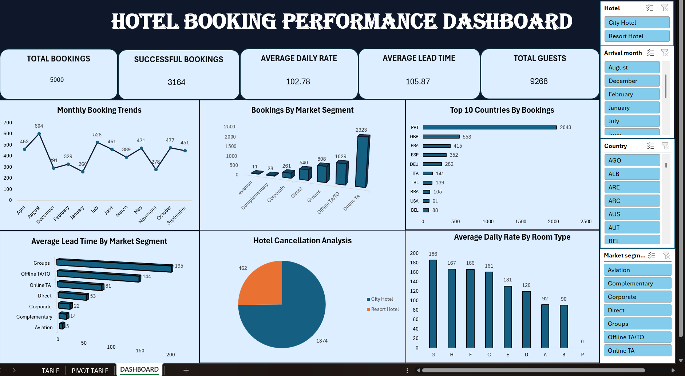

# Hotel-Booking-Performance-Analysis
Hotel booking performance analysis using Excel. Cleaned and analyzed booking data using Pivot Tables, Pivot Charts, Slicers, and KPI cards to identify booking trends, room-type performance, market segments, and key business insights.

## Tools Used

- Microsoft Excel
- Pivot Tables
- Pivot Charts
- Slicers
- KPI Cards
- Data Cleaning
- Dashboard Creation

## Project Overview

This project analyzes hotel booking data to identify important booking patterns and performance insights.

## Dashboard

